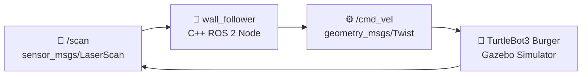

# 🤖 TurtleBot3 Maze Solver

[](https://docs.ros.org/en/humble/)
[](https://isocpp.org/)
[](https://gazebosim.org/)
[](package.xml)

A ROS 2-based autonomous navigation project in which a **TurtleBot3 Burger** navigates a simulated 5×5 maze using a **Proportional-Derivative (PD) Right-Hand Wall Following Algorithm**.

The robot uses 360° LiDAR laser scan data to detect surrounding walls and obstacles, then continuously adjusts its linear and angular velocity via a high-performance C++ ROS 2 node to navigate smoothly through the maze.

**Technology Stack:** ROS 2 Humble · Gazebo Classic · TurtleBot3 · C++17 · Python · colcon

---

## 📌 Overview

The objective of this project is to develop an autonomous TurtleBot3 that can navigate through a predefined maze without manual control.

The robot:
* Detects surrounding walls using **LiDAR/LaserScan** data on `/scan`.
* Maintains a safe, constant distance from the right wall using **PD Control**.
* Turns left when an obstacle blocks its path in front.
* Turns right when an opening/gap is detected on the right side.
* Moves forward while continuously correcting its heading and distance.
* Publishes velocity commands on `/cmd_vel` to control motion in real time.

The navigation strategy is based on the **Right-Hand Rule**, a classic maze-solving technique.

---

# 🏗️ Project Architecture

```text
                         ┌──────────────────────┐
                         │      Gazebo          │
                         │   Maze Simulation    │
                         └──────────┬───────────┘
                                    │
                                    │ LaserScan (/scan)
                                    ▼
                         ┌──────────────────────┐
                         │  wall_follower.cpp   │
                         │                      │
                         │  Navigation Logic    │
                         │  Right-Hand Rule     │
                         │  (PD Controller)     │
                         └──────────┬───────────┘
                                    │
                                    │ Twist (/cmd_vel)
                                    ▼
                         ┌──────────────────────┐
                         │     TurtleBot3       │
                         │       Burger         │
                         └──────────────────────┘
```

### Data Flow & Communication Topology

```text
Gazebo Simulation Environment
  │
  │ Sensor Data (sensor_msgs/msg/LaserScan)
  ▼
/scan Topic
  │
  ▼
wall_follower (C++ ROS 2 Node)
  │
  │ Velocity Commands (geometry_msgs/msg/Twist)
  ▼
/cmd_vel Topic
  │
  ▼
TurtleBot3 Burger Differential Drive Controller
```



---

# 📁 Project Structure

```text
maze_solver/
│
├── CMakeLists.txt              # Defines how the C++ node & package are built
├── package.xml                 # Package metadata and ROS 2 dependencies
│
├── src/
│   └── wall_follower.cpp       # Main C++ autonomous navigation node
│
├── launch/
│   └── my_maze.launch.py       # Launches Gazebo simulation world & spawner
│
└── worlds/
    └── maze_arena.world        # Defines the 5x5 simulated maze environment
```

## File Description

| File | Description |
| :--- | :--- |
| [`CMakeLists.txt`](CMakeLists.txt) | Defines build rules for the C++ executable (`wall_follower`) and installs launch/world assets |
| [`package.xml`](package.xml) | Package manifest defining dependencies (`rclcpp`, `geometry_msgs`, `sensor_msgs`) |
| [`src/wall_follower.cpp`](src/wall_follower.cpp) | Core C++ ROS 2 wall-following node (LiDAR sector filtering & PD control loop) |
| [`launch/my_maze.launch.py`](launch/my_maze.launch.py) | Python launch file starting `gzserver`, `gzclient`, `robot_state_publisher`, and spawner |
| [`worlds/maze_arena.world`](worlds/maze_arena.world) | Gazebo 3D world file containing the enclosed 5×5 maze walls |

---

# ⚙️ Requirements

## Operating System
* **Ubuntu 22.04 LTS** (or WSL2 with Ubuntu 22.04)

## Software
* **ROS 2 Humble Hawksbill** (Desktop Install)
* **Gazebo Classic** (v11)
* **TurtleBot3 Packages** (`turtlebot3`, `turtlebot3_gazebo`, `turtlebot3_simulations`)
* **colcon** build tool
* **C++17 Compiler** (`g++` / `clang`)

---

# 📦 Installation

If ROS 2 Humble is already installed, you can skip the ROS installation section.

### 1. ROS 2 Humble

Install ROS 2 Humble Desktop:

```bash
sudo apt update
sudo apt install -y software-properties-common curl
sudo curl -sSL https://raw.githubusercontent.com/ros/rosdistro/master/ros.asc | sudo apt-key add -
sudo sh -c 'echo "deb http://packages.ros.org/ros2/ubuntu $(lsb_release -cs) main" > /etc/apt/sources.list.d/ros2.list'

sudo apt update
sudo apt install -y ros-humble-desktop
```

### 2. TurtleBot3 and Gazebo

```bash
sudo apt install -y \
    ros-humble-gazebo-ros-pkgs \
    ros-humble-turtlebot3 \
    ros-humble-turtlebot3-simulations \
    ros-humble-turtlebot3-gazebo
```

### 3. colcon Build Tool

```bash
sudo apt install -y python3-colcon-common-extensions
```

### 4. Source ROS 2 Environment

Add ROS 2 to your shell configuration:

```bash
echo "source /opt/ros/humble/setup.bash" >> ~/.bashrc
source ~/.bashrc
```

---

# 🚀 Getting Started

## 1. Clone or Copy the Project

Place the project inside your ROS 2 workspace or home directory.

For example, inside a standard ROS 2 workspace:

```bash
mkdir -p ~/ros2_ws/src
cd ~/ros2_ws/src
# Copy or git clone maze_solver here
```

Or directly in your home directory:

```bash
cd ~/Documents/maze_solver
```

---

## 2. Build the Package

Source ROS 2 and build using `colcon`:

```bash
cd ~/Documents/maze_solver
source /opt/ros/humble/setup.bash
colcon build
```

After a successful build, you should see output similar to:

```text
Starting >>> maze_solver
Finished <<< maze_solver [~20s]

Summary: 1 package finished
```

Now source the generated workspace setup script:

```bash
source install/setup.bash
```

> 💡 **Note:** Run `colcon build` again whenever you modify C++ source code in `src/wall_follower.cpp`.

---

## 3. Launch the Simulation

Open **Terminal 1**.

Navigate to the project folder, source setup scripts, set the TurtleBot3 model, and launch Gazebo:

```bash
cd ~/Documents/maze_solver
source /opt/ros/humble/setup.bash
source install/setup.bash

# Tell ROS which TurtleBot3 model to use
export TURTLEBOT3_MODEL=burger

# Launch the maze simulation
ros2 launch maze_solver my_maze.launch.py
```

Gazebo will open with the TurtleBot3 spawned inside the maze arena at position ($x=-1.6, y=1.6$).  
*Keep this terminal running.*

---

## 4. Start Autonomous Navigation

Open **Terminal 2** (`Ctrl + Alt + T`).

Source the required environment and start the C++ navigation node:

```bash
cd ~/Documents/maze_solver
source /opt/ros/humble/setup.bash
source install/setup.bash

# Run the wall follower node
ros2 run maze_solver wall_follower
```

The robot will now automatically begin navigating through the maze!

---

# 🧠 Navigation Algorithm

The project implements the **Right-Hand Rule** enhanced with **Proportional-Derivative (PD) wall distance control**.

The robot continuously evaluates its surroundings by grouping LiDAR ranges into three sectors:
- **Front Sector ($F$)**: $0^{\circ} \text{ to } 20^{\circ}$ and $340^{\circ} \text{ to } 360^{\circ}$
- **Right Sector ($R$)**: $260^{\circ} \text{ to } 280^{\circ}$
- **Front-Right Sector ($FR$)**: $300^{\circ} \text{ to } 330^{\circ}$

### Decision Logic Flowchart

```text
                    START (Receive LiDAR scan)
                              │
                              ▼
                      Is Front < 0.35m?
                         /          \
                       YES           NO
                        │             │
                        ▼             ▼
                   Turn LEFT     Is Right & Front-Right > 0.75m?
                  (vx=0, wz=1.2)        /           \
                                      YES            NO
                                       │              │
                                       ▼              ▼
                                  Turn RIGHT     PD Wall Following
                                 (vx=0.05, wz=-1.0)   Calculate error
                                                      error = R - 0.28m
                                                      wz = -(Kp*error + Kd*d_error)
```

### Main Control Rules

| Condition | Robot Action | Speed ($v_x$) | Angular Velocity ($\omega_z$) |
| :--- | :--- | :--- | :--- |
| Front distance $< 0.35\text{ m}$ | **Turn Left** (Obstacle Avoidance) | $0.0\text{ m/s}$ | $+1.2\text{ rad/s}$ |
| Right & Front-Right $> 0.75\text{ m}$ | **Turn Right** (Corner/Gap Opening) | $0.05\text{ m/s}$ | $-1.0\text{ rad/s}$ |
| Otherwise | **PD Wall Following** | Dynamic ($0.08 - 0.22\text{ m/s}$) | $-\left( K_p e(t) + K_d \Delta e \right)$ |

### PD Controller Formulation

$$\text{error}(t) = R(t) - d_{\text{target}}$$

$$\Delta \text{error} = \text{error}(t) - \text{error}(t-1)$$

$$\omega_z = -\left( K_p \cdot \text{error}(t) + K_d \cdot \Delta \text{error} \right)$$

Where $d_{\text{target}} = 0.28\text{ m}$, $K_p = 2.0$, $K_d = 0.4$.

---

# 📡 Sensor and Control Data

The `wall_follower` node processes `sensor_msgs/msg/LaserScan` and publishes `geometry_msgs/msg/Twist`.

Example log output in Terminal 2:

```text
[wall_follower]: F:0.85 R:0.28 FR:0.91  vx:0.18 wz:0.00
[wall_follower]: F:0.72 R:0.29 FR:0.88  vx:0.15 wz:-0.10
```

| Parameter | Description |
| :--- | :--- |
| `F` | Minimum distance to wall in **front** (metres) |
| `R` | Minimum distance to wall on the **right** (metres) |
| `FR` | Minimum distance to wall on **front-right** (metres) |
| `vx` | Linear velocity along X-axis ($m/s$) |
| `wz` | Angular velocity around Z-axis ($rad/s$) |

### ROS Topics

| Topic Name | Message Type | Description |
| :--- | :--- | :--- |
| `/scan` | `sensor_msgs/msg/LaserScan` | 360-degree LiDAR range data from Gazebo |
| `/cmd_vel` | `geometry_msgs/msg/Twist` | Velocity command sent to TurtleBot3 |

---

# 🔄 How the System Works

The complete end-to-end loop operates continuously at high frequency:

```text
        Gazebo 3D Maze World
                 │
                 ▼
       TurtleBot3 Burger Model
                 │
                 ▼
       LiDAR Laser Scanner Sensor
                 │
                 ▼
             /scan Topic
                 │
                 ▼
     wall_follower.cpp (ROS 2 C++ Node)
                 │
      ┌──────────┴──────────┐
      │  LiDAR Filtering    │
      │  Right-Hand Rule    │
      │  PD Feedback Control│
      └──────────┬──────────┘
                 │
                 ▼
          /cmd_vel Topic
                 │
                 ▼
       TurtleBot3 Differential Drive
                 │
                 ▼
      Autonomous Maze Navigation
```

---

# 🛑 Stopping the System

To stop the navigation node:
- In **Terminal 2**, press `Ctrl + C`.

To close the Gazebo simulator:
- In **Terminal 1**, press `Ctrl + C`.

---

# 🐛 Troubleshooting

### 1. Package Not Found Error
```text
Package 'maze_solver' not found
```
**Fix:** Ensure you built the workspace and sourced `install/setup.bash`:
```bash
cd ~/Documents/maze_solver
source install/setup.bash
```

### 2. `colcon: command not found`
**Fix:** Install the colcon build extensions:
```bash
sudo apt install python3-colcon-common-extensions
```

### 3. `install/setup.bash` Does Not Exist
**Fix:** Build the workspace first using:
```bash
cd ~/Documents/maze_solver
colcon build
source install/setup.bash
```

### 4. Robot Does Not Move
Make sure:
1. Gazebo is fully open and unpaused.
2. `TURTLEBOT3_MODEL` was exported (`export TURTLEBOT3_MODEL=burger`).
3. Terminal 2 is running `ros2 run maze_solver wall_follower`.
4. Verify active topics with:
   ```bash
   ros2 topic list
   ros2 topic echo /cmd_vel
   ```

### 5. Gazebo Screen Blank or Crashes (WSL2 / Virtual Machines)
If running on VM or WSL2, enable software rendering:
```bash
export LIBGL_ALWAYS_SOFTWARE=1
ros2 launch maze_solver my_maze.launch.py
```

---

# 🧪 Testing Checklist

After launching the project, verify the following:

- [x] Gazebo starts successfully with 3D graphics rendering.
- [x] The 5×5 maze environment (`maze_arena.world`) loads correctly.
- [x] TurtleBot3 Burger spawns inside the maze at start position ($x=-1.6, y=1.6$).
- [x] `/scan` publishes valid sensor data (`ros2 topic hz /scan`).
- [x] `wall_follower` node starts and logs range statistics.
- [x] `/cmd_vel` receives velocity commands (`ros2 topic echo /cmd_vel`).
- [x] The robot follows the right wall smoothly without oscillating heavily.
- [x] The robot turns left on dead-end walls and turns right at corridor openings.
- [x] The robot successfully navigates through the entire maze.

---

# 🔧 Development Workflow

The primary navigation logic is written in C++ and located in [`src/wall_follower.cpp`](src/wall_follower.cpp).

To modify navigation thresholds or gains:

1. Open [`src/wall_follower.cpp`](src/wall_follower.cpp).
2. Modify parameters (e.g. `desired_distance_`, `Kp_`, `Kd_`).
3. Rebuild and restart:

```bash
cd ~/Documents/maze_solver
colcon build
source install/setup.bash
ros2 run maze_solver wall_follower
```

---

# 📊 Key Parameters

Navigation thresholds configured in [`src/wall_follower.cpp`](src/wall_follower.cpp):

| Parameter | Default Value | Description |
| :--- | :---: | :--- |
| `desired_distance_` | `0.28 m` | Target distance to maintain from the right wall |
| `Kp_` | `2.0` | Proportional gain for turning response |
| `Kd_` | `0.4` | Derivative gain to dampen steering oscillations |
| `max_speed_` | `0.22 m/s` | Maximum forward linear velocity |
| `min_speed_` | `0.08 m/s` | Minimum linear velocity in tight corners |
| Front obstacle threshold | `0.35 m` | Front distance to trigger left turn |
| Right opening threshold | `0.75 m` | Right & front-right distance to trigger right turn into gap |

---

# 🎯 Project Objectives

* Implement autonomous mobile robot maze navigation in ROS 2.
* Understand ROS 2 publisher/subscriber paradigms and C++ nodes (`rclcpp`).
* Process 2D LiDAR (`LaserScan`) point clouds in real time.
* Publish velocity commands to differential drive robots via `/cmd_vel`.
* Simulate TurtleBot3 platforms in Gazebo Classic.
* Apply classic right-hand rule maze-solving logic combined with PD feedback control.

---

# 🛠️ Technologies Used

| Technology | Role |
| :--- | :--- |
| **ROS 2 Humble** | Middleware & node communication framework |
| **Gazebo Classic (v11)** | 3D physics simulator |
| **TurtleBot3 Burger** | Simulated mobile robot platform |
| **C++17** | Core wall-following navigation node |
| **Python 3** | ROS 2 launch system configuration |
| **LaserScan / LiDAR** | Environment perception sensor |
| **colcon** | ROS 2 package build system |

---

# 📌 Future Improvements

* [ ] Add a **goal/finish-point detector** and automatic stopping mechanism.
* [ ] Integrate full **PID control** (adding integral gain $K_i$) for steady-state error elimination.
* [ ] Integrate dynamic global path planning with **SLAM** (`slam_toolbox`) & `Nav2`.
* [ ] Visualize live LiDAR ray sweeps and TF frames in **RViz2**.
* [ ] Expose navigation parameters as dynamic **ROS 2 Node Parameters**.
* [ ] Add automated recovery behaviors when trapped in infinite loops or deadlocks.

---

# 👨‍💻 Project Summary

**Maze Solver** demonstrates autonomous navigation of a TurtleBot3 robot inside a simulated maze using ROS 2 Humble and Gazebo.

The robot uses 360° LiDAR data to map its immediate surroundings and applies an enhanced **Right-Hand Rule with PD distance control** to make smooth driving decisions.

```text
  ROS 2 Humble
       +
  Gazebo Classic
       +
  TurtleBot3 Burger
       +
  LiDAR Sensor Processing
       +
  C++ PD Wall-Following Node
       ↓
  Autonomous Maze Navigation
```

---

## 📄 License

Distributed under the **Apache License 2.0**. See [`package.xml`](package.xml) for details.

---

*Built with ROS 2 Humble · Gazebo Classic · TurtleBot3 Burger · C++17*

